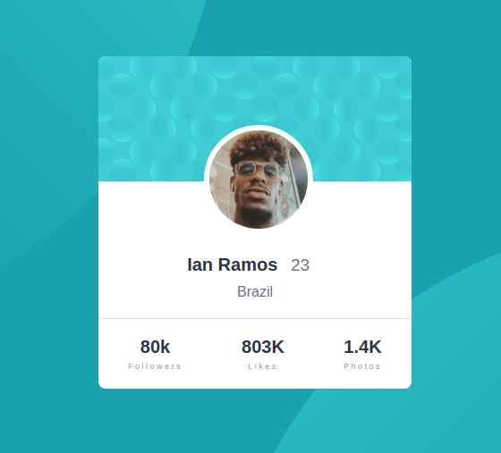
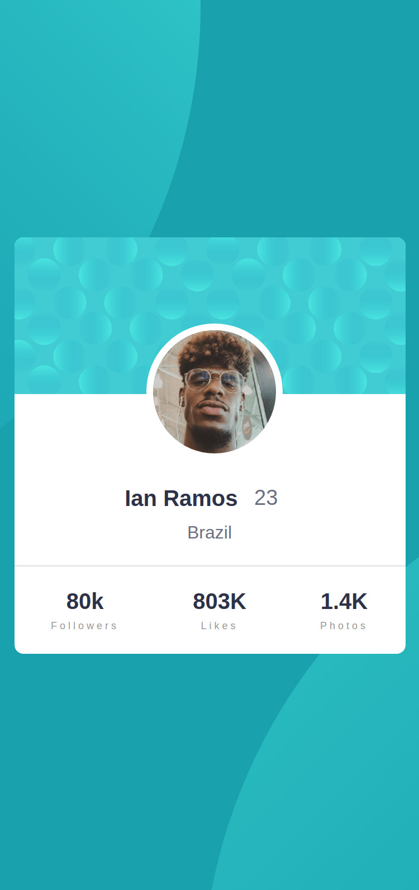

  

  <a href="#interrobang-the-challenge">About</a>&nbsp;&nbsp;&nbsp;|&nbsp;&nbsp;&nbsp;
  <a href="#confetti_ball-preview">Preview</a>&nbsp;&nbsp;&nbsp;|&nbsp;&nbsp;&nbsp;
  <a href="#paperclip-links">Links</a>&nbsp;&nbsp;&nbsp;|&nbsp;&nbsp;&nbsp;
  <a href="#rocket-built-with">Technologies</a>&nbsp;&nbsp;&nbsp;|&nbsp;&nbsp;&nbsp;
  <a href="#gem-what-i-learned">Learning</a>&nbsp;&nbsp;&nbsp;|&nbsp;&nbsp;&nbsp;
  <a href="#confetti_ball-how-to-contribute">How to contribute</a>&nbsp;&nbsp;&nbsp;|&nbsp;&nbsp;&nbsp;
  <a href="#key-license">License</a>

---

## :interrobang: The Challenge

This is one of the challenges designed by Frontend Mentor in order to train and test my skills and knowledge using HTML and CSS. 🔥🚀

This project is a profile card component.

Your users should be able to:

- View the optimal layout depending on their device's screen size

## :confetti_ball: Preview:

  
  

## :paperclip: Links:

- Solution URL: https://www.frontendmentor.io/solutions/responsive-car-preview-card-component-GdEeL0WzCu
- Live Site URL: https://i-ramoss.github.io/car-preview-component/

## :rocket: Built with:

- Semantic HTML5 markup
- CSS custom properties

## :gem: What I learned:

- I learned to create more responsive and better structured backgrounds using `background-image` instead of `img` tags.
- I learned how to better position backgrounds, based on the `width` of the screen.

## :confetti_ball: How to contribute:

- Make a fork;
- Create a branch with your functionality: `git checkout -b <your_feature_name>`;
- Submit the changes made: `git commit -am 'type(scope): <description>'`;
- Push your branch: `git push origin <your_branch_name>`.

After your request is accepted and added to the project, you can delete your branch.

## :key: License:

This project in under MIT license, for more details check in [LICENSE][license].  
Feel free to bring new features or fix problems, it will be a pleasure! 💜

---

  Made with 💚  by <strong>Ian Ramos</strong> 🔥
  <a href='https://www.linkedin.com/in/ian-ramos/'>Get in touch!</a>

